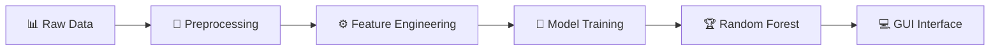

# 💬 T20I Cricket Prediction Model

<div align="center">


**🎯 Predict T20I Cricket Match Winners with 95% Accuracy using Random Forest!**

</div>

---

## 📊 Project Overview

> 🚀 **AI-powered cricket match prediction system** that analyzes historical T20I data to predict match outcomes with exceptional accuracy.

This machine learning project uses advanced algorithms to forecast T20 International cricket match winners based on:
-  Historical match statistics
-  Venue performance data  
-  Toss decisions impact
-  Team-specific analytics

---

## 🎯 Key Features

<table>
<tr>
<td align="center">

<br><b> AI Prediction</b>
<br>95% Accuracy Rate
</td>
<td align="center">

<br><b> Interactive GUI</b>
<br>User-Friendly Interface
</td>
<td align="center">

<br><b> Venue Analysis</b>
<br>Ground-Specific Stats
</td>
<td align="center">

<br><b> Match History</b>
<br>Historical Data Insights
</td>
</tr>
</table>

---

## 🔬 Machine Learning Models Comparison

| Model | Accuracy | Status |
|-------|----------|--------|
| 🌟 **Random Forest** | **95.00%** | ✅ **Best Performer** |
| ⚡ XGBoost | 66.94% | ⚠️ Moderate |
| 📈 SVC | 11.00% | ❌ Poor |
| 📊 Logistic Regression | 10.78% | ❌ Poor |
| 🔄 AdaBoost | 9.21% | ❌ Poor |

### 🏆 Why Random Forest Won?
```
✅ Handles categorical variables excellently
✅ Captures non-linear relationships  
✅ Prevents overfitting with ensemble approach
✅ Perfect for multi-class classification
```

---

## 📋 Dataset Features

<div align="left">

| Feature | Description | Type |
|---------|-------------|------|
|  **Bat First** | Toss winner team | Categorical |
|  **Bat Second** | Team batting second | Categorical |
|  **Venue** | Match ground/stadium | Categorical |
|  **Winner** | Match winner (target) | Label |

</div>

---

## 🖥️ GUI Features

### 1️⃣ Match Prediction
> 🎯 **Input**: Team 1, Team 2, Venue, Toss Winner  
> 📤 **Output**: Predicted match winner

### 2️⃣ Historical Verification  
> 📊 **View**: Past match statistics for selected teams  
> ✅ **Verify**: Model accuracy against actual results

### 3️⃣ Venue-Specific Analysis
> 📊 **Analyze**: Ground-specific team performance  
> 📈 **Trends**: Historical venue statistics

---

## 🛠️ Technical Implementation



### 🔧 Development Steps:
1. **📊 Data Preprocessing** - Ball-by-ball to match-level aggregation
2. **🏷️ Feature Engineering** - One-hot encoding & label encoding  
3. **📏 Scaling** - StandardScaler implementation
4. **🎯 Training** - 80/20 train-test split
5. **💻 GUI Development** - Interactive prediction interface

---

## 🎯 Real-World Example

<div style="background-color: #f8f9fa; padding: 15px; border-radius: 8px; border-left: 4px solid #28a745;">

**📅 Test Case**: India vs Pakistan at Dubai International Stadium  
**📊 Historical Data**: Pakistan won both previous matches when India batted first  
**🎯 Model Prediction**: **Pakistan** (Winner)  
**✅ Validation**: Matches historical trend!

</div>

---

## 📈 Project Impact

<div align="left">

| Metric | Value |
|--------|-------|
| 🎯 **Accuracy** | 95% |
| 📊 **Models Tested** | 5 |
| 💻 **GUI Features** | 3 |
| 📅 **Venues Covered** | Multiple International Grounds |

</div>

---

## 🚀 Getting Started

```bash
# Clone the repository
git clone <https://github.com/MudasirNaeem1/MachineLearning-T20I-Matches-Prediction.git>

# Install dependencies  
pip install -r requirements.txt

# Run the application
ML_PROJECT (T20I CRICKET PREDICTION MODEL).ipynb
```

---

## 👥 Team

**NATIONAL UNIVERSITY OF COMPUTER & EMERGING SCIENCES**  
📍 Karachi Campus | 🎓 BAI-5A  
👤 **Instructor**: Sir Usama Bin Umar  
📅 **Date**: December 14, 2024

---

## 👤 Contributions

  Interested in educational AI research? ⭐ **Star this repository!**
  
  Have questions about the implementation? 💭 **Let's discuss!**
  
</div>
<div align="center">  
  
  Found this project interesting? ⭐ **Star the repository!**
  
  Have suggestions? 💭 **Reach out!**
  
</div>
